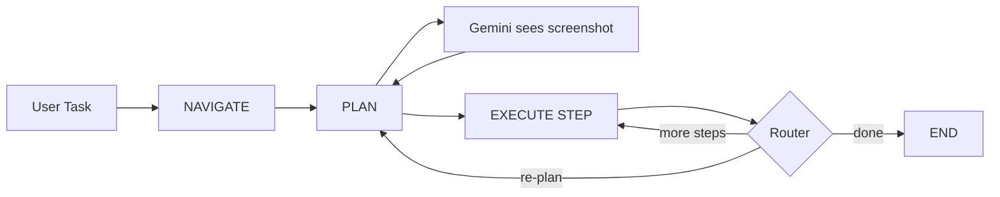

# Percept — Visual Agent

*A multimodal AI agent that sees and operates the web like a human.*

[](https://python.org)
[](https://fastapi.tiangolo.com)
[](https://react.dev)
[](https://langchain.com)
[](https://ai.google.dev)
[](https://cloud.google.com/run)
[](https://firebase.google.com)

| [Demo Video](https://youtube.com) | [Live website](https://project-70591921-7d7a-4043-ba8.web.app/) | [Architecture Diagram](#architecture-overview) |

---

## Problem Statement

### The Brittle Bot Problem

Traditional web automation relies on **CSS selectors** and **XPath**. When a site updates its markup, renames a class, or changes structure, scripts break. Maintenance is costly and scaling across many sites is impractical.

### How Visual Reasoning Fixes It

Percept uses **zero-shot visual planning**: the agent receives a live JPEG screenshot of the page and a natural-language task. **Gemini 2.5 Flash** reasons over what it *sees*—buttons, forms, labels—and outputs structured actions (click element 7, type in 12, scroll). No selectors are hardcoded. When the UI changes, the same agent still works because it interprets the current pixels, not the DOM tree.

---

## Architecture Overview

The agent runs a **LangGraph** loop: **Observe → Plan → Execute**. In-memory state management (backend `SessionManager` dict and frontend Zustand store) holds the current task and steps. Playwright runs in a singleton browser pool with headed/headless switching. Planning is zero-shot: Gemini gets the screenshot and task text with no fine-tuning.



### System Architecture


*High-level system: React frontend (Firebase Hosting) ↔ REST/SSE ↔ FastAPI backend (Cloud Run) ↔ LangGraph agent pipeline ↔ Playwright browser automation ↔ Gemini (Vertex AI / AI Studio).*

---

## Key Features

- **Visual Agent grounding** — `label_elements.js` injects red numeric overlays (`[data-visual-agent-id="N"]`) on every interactive DOM element. Gemini references elements by number for pixel-perfect targeting without selectors.

- **Multimodal Reasoner** — Handles dynamic content, autocomplete overlays, SPAs, and complex login flows. The executor captures before/after screenshots per step; the planner can re-plan when the page state changes unexpectedly.

- **LangGraph Agentic Loop** — `orchestrator.py` implements a StateGraph: **NAVIGATE → PLAN → EXECUTE STEP** with a router that either continues execution, triggers re-planning, or ends. Hard caps: 30 steps, 15 re-plan rounds. Automatic re-plan on failure or when the task is not yet complete.

- **SSE Real-Time Streaming** — Live screenshots and step logs stream to the dashboard via Server-Sent Events (`GET /api/agent/stream/{id}`). Polling fallback every 2s if SSE fails.

- **Voice Input** — Browser-native Web Speech API in the Task Dock; no server-side STT cost.

- **Cloud-Native CI/CD** — [`.github/workflows/deploy.yml`](.github/workflows/deploy.yml) builds the backend Docker image, pushes to GCP Artifact Registry, and deploys to Cloud Run on every push to the `deployment` branch.

---

## Tech Stack

| Frontend | Backend |
|----------|---------|
| React 18, Vite, TypeScript | Python 3.11+, FastAPI |
| Tailwind CSS, shadcn/ui (Radix) | LangChain, LangGraph |
| Zustand (state), TanStack Query | langchain-google-genai, langchain-google-vertexai |
| React Router, Lucide icons | Playwright, Pydantic v2 |
| Web Speech API (voice) | Uvicorn |

---

## Local Setup

### Prerequisites

- Python 3.11+
- Node.js 18+
- [Google AI Studio API key](https://aistudio.google.com/app/apikey) or GCP project with Vertex AI

### Step 1 — Backend

```bash
cd backend
pip install -r requirements.txt
playwright install chromium
cp .env.example .env
```

Edit `backend/.env` and set:

```
GOOGLE_API_KEY=your-api-key-here
```

### Step 2 — Frontend

```bash
cd agent-vision-dashboard-main/agent-vision-dashboard-main
npm install
```

Create `.env` with `VITE_API_URL=` (empty uses Vite proxy to `http://localhost:8000` in dev).

### Step 3 — Run

**Terminal 1 — Backend:**

```bash
cd backend
uvicorn main:app --reload --port 8000
```

**Terminal 2 — Frontend:**

```bash
cd agent-vision-dashboard-main/agent-vision-dashboard-main
npm run dev
```

- Frontend: [http://localhost:5173](http://localhost:5173)
- API docs: [http://localhost:8000/docs](http://localhost:8000/docs)

---

## Cloud Deployment

- **Backend** — Google Cloud Run (`us-central1`). Deployed via GitHub Actions from [`.github/workflows/deploy.yml`](.github/workflows/deploy.yml): Docker build → Artifact Registry → Cloud Run. Uses Vertex AI and `gemini-2.5-flash` in production. Configured with `min-instances=1`, `timeout=3600` for long-running SSE streams.

- **Frontend** — Firebase Hosting. Build with `npm run build` in the dashboard app, then `firebase deploy`. SPA: all routes rewrite to `index.html`.

- **Live backend (example):** `https://ui-navigator-backend-94139147538.us-central1.run.app`  
- **GCP project (example):** `project-70591921`

---

## Environment Variables

| Variable | Description | Required |
|----------|-------------|----------|
| `GOOGLE_API_KEY` | Google AI Studio API key (when not using Vertex AI) | If `USE_VERTEX_AI` is false |
| `GEMINI_MODEL` | Model name (default: `gemini-2.5-flash`) | No |
| `USE_VERTEX_AI` | Use Vertex AI instead of AI Studio (default: `false`) | No |
| `GOOGLE_CLOUD_PROJECT` | GCP project ID (for Vertex AI) | If `USE_VERTEX_AI` is true |
| `GOOGLE_CLOUD_LOCATION` | Vertex AI region (default: `us-central1`) | No |
| `BACKEND_PORT` | Server port (default: `8000`) | No |
| `FRONTEND_URL` | Allowed CORS origin (default: `http://localhost:5173`) | No |
| `SINGLE_MODEL_REQUEST_MODE` | Use one model for planning (default: `true`) | No |

---

## The Team

- **Balaji** — Lead Developer (design, backend, agent pipeline, deployment)

---

## Future Roadmap

- **EHR (Electronic Health Record) automation** — Automate clinical data entry in hospital portals and EHR systems using the same visual grounding and multimodal reasoning.
- **Automated QA testing** — Record-and-replay visual regression testing without writing or maintaining selectors; agents validate UI behavior from screenshots.
- **Multi-tab / multi-agent parallelism** — Run multiple browser sessions concurrently for higher throughput.
- **Persistent session storage** — Replace the in-memory session dict with Redis or Firestore for cross-restart and multi-instance support.
- **Google Cloud STT/TTS** — Integrate server-side speech-to-text and text-to-speech (stubs exist in `routers/voice.py`).
